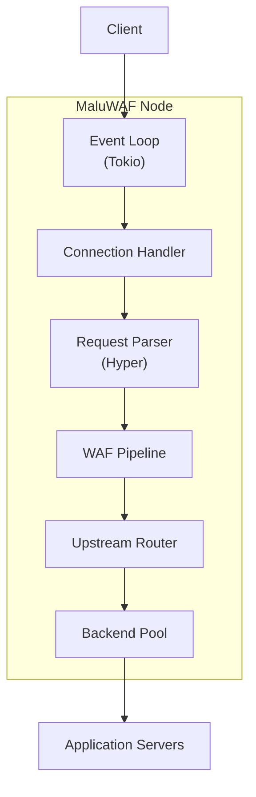

# MaluWAF Architecture

A production-ready WAF and reverse proxy built for high-performance, high-availability deployments.

## Overview

MaluWAF combines a nginx-inspired reverse proxy concurrency model with a sophisticated WAF (Web Application Firewall) system. It's designed for ease of deployment while providing enterprise-grade protection and performance.

```
┌─────────────────────────────────────────────────────────────────────────────┐
│                              MaluWAF Architecture                            │
└─────────────────────────────────────────────────────────────────────────────┘

                                    Internet
                                        │
                                        ▼
┌─────────────────────────────────────────────────────────────────────────────┐
│                              Overseer Node                                   │
│  ┌─────────────────────────────────────────────────────────────────────┐   │
│  │  • Global health monitoring                                         │   │
│  │  • Traffic distribution orchestration                                │   │
│  │  • Leader election (Raft consensus) — Planned                      │   │
│  │  • Configuration synchronization                                     │   │
│  └─────────────────────────────────────────────────────────────────────┘   │
└─────────────────────────────────────────────────────────────────────────────┘
            │                           │                           │
            ▼                           ▼                           ▼
    ┌───────────────┐           ┌───────────────┐           ┌───────────────┐
    │ Master Node 1 │           │ Master Node 2 │           │ Master Node 3 │
    │ ┌───────────┐ │           │ ┌───────────┐ │           │ ┌───────────┐ │
    │ │  Worker   │ │           │ │  Worker   │ │           │ │  Worker   │ │
    │ │  Pool A   │ │           │ │  Pool B   │ │           │ │  Pool C   │ │
    │ └───────────┘ │           │ └───────────┘ │           │ └───────────┘ │
    └───────────────┘           └───────────────┘           └───────────────┘
            │                           │                           │
            └───────────────────────────┼───────────────────────────┘
                                        │
                                        ▼
                              ┌─────────────────┐
                              │  Upstream Apps  │
                              │  • Static Files │
                              │  • PHP-FPM      │
                              │  • Granian      │
                              │  • FastCGI      │
                              └─────────────────┘
```

## Core Components

### 1. Reverse Proxy (Tokio + Hyper)

The reverse proxy layer is heavily inspired by nginx's event-driven architecture, made possible by:

- **Tokio** - Asynchronous runtime for efficient I/O handling
- **Hyper** - HTTP/1.1 and HTTP/2 protocol implementation

This combination provides:
- Non-blocking I/O for maximum concurrency
- Connection pooling and keep-alive
- HTTP/2 multiplexing
- HTTP/3 (QUIC) support



### Request Flow Through Components

When a request arrives, it passes through these components in sequence:

```
1. Listener (TCP/UDP)
      │
      ▼
2. Connection Handler (TLS termination, HTTP parsing)
      │
      ▼
3. Router (domain-based routing to site config)
      │
      ▼
4. WAF Pipeline (attack detection, bot detection, rate limiting)
      │
      ▼
5. Request Handler (static files, FastCGI, proxy, app server)
      │
      ▼
6. Upstream Pool (backend selection, connection pooling)
      │
      ▼
7. Response Handler (caching, compression, header modification)
      │
      ▼
8. Client Response
```

**Component Responsibilities:**

| Component | Responsibility | Key Types |
|-----------|----------------|-----------|
| Listener | Accept connections, TLS handshake | `TcpListener`, `QuicListener` |
| Connection Handler | Protocol negotiation, keep-alive | `Http1Connection`, `Http2Connection` |
| Router | Match host/path to site config | `Router`, `SiteConfig` |
| WAF Pipeline | Security inspection, decisions | `WafCore`, `AttackDetector` |
| Request Handler | Serve content, proxy requests | `StaticHandler`, `ProxyHandler` |
| Upstream Pool | Backend management, health | `UpstreamPool`, `Backend` |
| Response Handler | Transform responses | `Cache`, `Compress` |

### 2. WAF Protection Layers

The WAF implements multiple protection layers inspired by EvilWaf, BunkerWeb, and SafeLine:

```
┌─────────────────────────────────────────────────────────────────────────────┐
│                          WAF Protection Pipeline                            │
└─────────────────────────────────────────────────────────────────────────────┘

  Client Request
          │
          ▼
┌─────────────────────────┐
│  1. Connection Layer   │
│  • SYN Flood Guard     │
│  • Rate Limiting       │
│  • IP Reputation       │
└─────────────────────────┘
          │
          ▼
┌─────────────────────────┐
│  2. Protocol Layer    │
│  • HTTP Parsing        │
│  • Header Validation   │
│  • Method Filtering    │
└─────────────────────────┘
          │
          ▼
┌─────────────────────────┐
│  3. Request Layer      │
│  • SQL Injection       │
│  • XSS Detection       │
│  • Path Traversal      │
│  • RFI/SSRF Blocking   │
│  • Custom Rules        │
└─────────────────────────┘
          │
          ▼
┌─────────────────────────┐
│  4. Bot Detection      │
│  • AI Crawler Blocking │
│  • Scraper Detection   │
│  • Honeypot Endpoints  │
│  • JS Challenge        │
└─────────────────────────┘
          │
          ▼
┌─────────────────────────┐
│  5. Response Layer     │
│  • Header Sanitization │
│  • Response Filtering   │
│  • Information Leakage │
└─────────────────────────┘
          │
          ▼
    Allow / Stall / Block / Tarpit
```

### How WAF Components Interact

```
WafCore (main orchestrator)
    │
    ├── RateLimiterManager ──► Token bucket algorithm
    │                              │
    │                              ▼
    │                         Per-IP tracking in memory
    │
    ├── BotDetector ───────────────► User-agent analysis
    │                              │   Behavior analysis
    │                              ▼   CSS honeypot
    │                             Scoring engine
    │
    ├── AttackDetector ───────────► Pattern matching
    │                              │   libinjection (SQLi/XSS)
    │                              ▼   Aho-Corasick (path traversal)
    │                             Context analysis
    │
    ├── ChallengeManager ─────────► PoW challenges
    │                              │   JS challenges
    │                              ▼   Cookie management
    │
    ├── BlockStore ───────────────► IP blocklist
    │                              │   Persistent storage
    │                              ▼   In-memory cache
    │
    └── ThreatIntelligence ──────► Mesh sync
                                     Local reputation
```

### 3. Overseer > Master-Worker Model

For high availability, MaluWAF uses a hierarchical node model:

```
┌─────────────────────────────────────────────────────────────────────────────┐
│                         Overseer-Master-Worker Model                       │
└─────────────────────────────────────────────────────────────────────────────┘

┌─────────────────────────────────────────────────────────────────────────────┐
│                               Overseer Cluster                               │
│                                                                             │
│    ┌──────────┐      ┌──────────┐      ┌──────────┐                      │
│    │ Overseer │      │ Overseer │      │ Overseer │                      │
│    │  Leader  │◄────►│  Follower│◄────►│  Follower│                      │
│    └──────────┘      └──────────┘      └──────────┘                      │
│         │                                                        (Raft)     │
└─────────┼───────────────────────────────────────────────────────────────────┘
          │
          │ Orchestrates
          ▼
┌─────────────────────────────────────────────────────────────────────────────┐
│                              Master Nodes                                   │
│                                                                             │
│  ┌────────────┐    ┌────────────┐    ┌────────────┐                      │
│  │  Master 1  │    │  Master 2  │    │  Master 3  │                      │
│  │ ┌────────┐ │    │ ┌────────┐ │    │ ┌────────┐ │                      │
│  │ │Worker 1│ │    │ │Worker 1│ │    │ │Worker 1│ │                      │
│  │ └────────┘ │    │ └────────┘ │    │ └────────┘ │                      │
│  │ ┌────────┐ │    │ ┌────────┐ │    │ ┌────────┐ │                      │
│  │ │Worker 2│ │    │ │Worker 2│ │    │ │Worker 2│ │                      │
│  │ └────────┘ │    │ └────────┘ │    │ └────────┘ │                      │
│  └────────────┘    └────────────┘    └────────────┘                      │
│                                                                             │
│  Each Master:                                                              │
│  • Manages worker lifecycle                                                │
│  • Handles site-specific configuration                                     │
│  • Reports health to Overseer                                              │
└─────────────────────────────────────────────────────────────────────────────┘
```

#### Process Communication

```
┌─────────────────┐     IPC      ┌─────────────────┐
│     Overseer    │◄────────────►│     Master      │
│   (Supervisor)  │              │  (Coordinator)  │
└─────────────────┘              └────────┬────────┘
                                           │ Spawn
                                           ▼
                                  ┌─────────────────┐
                                  │     Worker      │
                                  │  (Request IO)   │
                                  └─────────────────┘
```

**IPC Mechanisms:**
- **Unix Sockets**: Fast local communication between master and workers
- **Shared Memory**: Rate limiting counters, blocklists
- **QUIC Streams**: Cluster communication between overseers

#### Overseer Responsibilities

| Function | Description |
|----------|-------------|
| **Health Monitoring** | Continuous health checks of all master nodes |
| **Leader Election** | Raft-based consensus for overseer leadership |
| **Config Sync** | Distributed configuration propagation |
| **Traffic Routing** | Global load balancing decisions |
| **Failover** | Automatic redirection on node failure |

### 4. WAF-WAF Mesh Networking

MaluWAF supports QUIC-based peer-to-peer communication for distributed protection:

```
┌─────────────────────────────────────────────────────────────────────────────┐
│                        WAF-WAF QUIC Mesh Network                            │
└─────────────────────────────────────────────────────────────────────────────┘

                    ┌─────────────────┐
                    │   WAF Node A   │
                    │  (Primary DC)  │
                    │    10.0.0.1     │
                    └────────┬────────┘
                             │
               QUIC Streams  │  │
                     ┌───────┼───────┐
                     │       │       │
                     ▼       ▼       ▼
             ┌───────────┐   │   ┌───────────┐
             │           │   │   │           │
             ▼           ▼   ▼   ▼           ▼
       ┌──────────┐ ┌──────────┐ ┌──────────┐ ┌──────────┐
       │ WAF Node  │ │ WAF Node  │ │ WAF Node  │ │ WAF Node  │
       │    B      │ │    C      │ │    D      │ │    E      │
       │(Regional)│ │(Regional)│ │(Regional)│ │(Regional)│
       └──────────┘ └──────────┘ └──────────┘ └──────────┘
             │                                           │
             └───────────────────┬───────────────────────┘
                                 │
                     ┌───────────┴───────────┐
                     │                       │
                     ▼                       ▼
             ┌──────────────┐        ┌──────────────┐
             │   Attack     │        │    Clean     │
             │   Traffic    │        │   Traffic    │
             └──────────────┘        └──────────────┘
```

#### Mesh Communication Protocol

```
Node A                          Node B
   │                                │
   │──── QUIC Connection (TLS) ────│
   │                                │
   │──── Hello (role, capabilities)─│
   │◄─── HelloAck ─────────────────│
   │                                │
   │──── SeedListRequest ──────────│
   │◄─── SeedListResponse ─────────│
   │                                │
   │──── RouteQuery ───────────────│
   │◄─── RouteResponse ────────────│
   │                                │
   │──── Periodic HealthCheck ─────│
   │◄─── PeerLoadReport ───────────│
```

#### Use Cases

1. **DDoS Mitigation**
   - Shared IP reputation database
   - Coordinated rate limiting
   - Traffic scrubbing centers

2. **Threat Intelligence**
   - Real-time attack pattern sharing
   - Blocklist synchronization
   - Collective bot detection

3. **Geographic Distribution**
   - Regional traffic inspection
   - Cross-datacenter coordination
   - Consistent policy enforcement

### 5. Metrics Collection

MaluWAF collects comprehensive metrics across all components, with per-site attribution for billing, quota management, and traffic analysis.

```
┌─────────────────────────────────────────────────────────────────────────────┐
│                         Metrics Collection Pipeline                          │
└─────────────────────────────────────────────────────────────────────────────┘

 Worker Process                      Master Process              Admin API
      │                                    │                           │
      │  ┌─────────────────────┐          │                           │
      │  │  Per-Site Metrics  │          │                           │
      │  │  • Requests        │          │                           │
      │  │  • Blocked         │          │                           │
      │  │  • Bandwidth       │          │                           │
      │  └──────────┬──────────┘          │                           │
      │             │                      │                           │
      │        Heartbeat                  │                           │
      │             │                      │                           │
      │             ▼                      │                           │
      │    ┌────────────────┐              │                           │
      │    │    IPC Link   │──────────────►                           │
      │    │  (Unix Socket)│              │                           │
      │    └────────────────┘              │                           │
      │                                    │                           │
      │                             ┌──────▼──────┐                   │
      │                             │   Aggregate │                   │
      │                             │  Per-Site   │                   │
      │                             │   Metrics   │                   │
      │                             └──────┬──────┘                   │
      │                                    │                           │
      │                                    │  /api/stats/sites         │
      │                                    ▼                           │
      │                             ┌─────────────┐  ◄────────────  │
      │                             │  Admin API  │─────────────────┘
      │                             └─────────────┘
```

#### Per-Site Bandwidth Tracking

MaluWAF tracks bandwidth at multiple levels for comprehensive traffic accounting:

| Category | Direction | Description |
|----------|-----------|-------------|
| **Client Ingress** | → WAF | Raw requests from end users |
| **Response Egress** | WAF → | Block pages, challenges, errors |
| **Direct Proxy** | WAF ↔ Origin | When connecting directly to origin |
| **Mesh Proxy** | WAF ↔ Peer | When routing through WAF mesh |

This granular tracking is essential for:
- **Bandwidth quota management** in environments with limits
- **Per-site billing/chargeback** in multi-tenant deployments  
- **Traffic analysis** to identify unusual patterns
- **Capacity planning** based on actual usage

#### Security Through Process Isolation

The metrics pipeline maintains security through process separation:

1. **Worker processes** are isolated - each handles requests independently
2. **Heartbeat IPC** transmits only aggregated metrics, not raw request data
3. **Master process** aggregates without exposing worker internals
4. **Admin API** serves sanitized metrics to authorized clients

This architecture ensures that even if a worker is compromised, raw request data cannot be exfiltrated through the metrics channel.

## Deployment Features

### Built-in Application Support

MaluWAF handles common web serving scenarios without external dependencies:

```
┌─────────────────────────────────────────────────────────────────────────────┐
│                      Integrated Application Support                         │
└─────────────────────────────────────────────────────────────────────────────┘

┌─────────────────┐  ┌─────────────────┐  ┌─────────────────┐
│  Static Files   │  │    PHP-FPM      │  │     CGI        │
│                 │  │                 │  │  (Legacy)      │
│ • Directory     │  │ • Socket/TCP    │  │ • Perl         │
│   Listing       │  │ • Process Mgmt  │  │ • Shell         │
│ • MIME Types    │  │ • Pool Config   │  │ • Custom       │
│ • Caching       │  │ • Chroot        │  │   Scripts     │
└─────────────────┘  └─────────────────┘  └─────────────────┘

┌─────────────────┐  ┌─────────────────┐  ┌─────────────────┐
│    FastCGI      │  │    Granian      │  │   QUIC/HTTP3   │
│                 │ GI/ASGI │   (WS/   │  │                 │
│ • PHP-FPM       │  │    RSGI)        │  │ • HTTP/3       │
│ • Python        │  │                 │  │ • 0-RTT        │
│ • Custom        │  │ • Django        │  │ • Connection   │
│   Protocols     │  │ • Flask         │  │   Migration    │
│                 │  │ • FastAPI       │  │                 │
│                 │  │ • Flask         │  │                 │
└─────────────────┘  └─────────────────┘  └─────────────────┘
```

### How Application Handlers Work

**Static Files Handler:**
```
Request ──► Path Normalization ──► Security Check ──► File Lookup
                                                      │
                                                      ▼
                                             Range Request Support
                                                      │
                                                      ▼
                                             MIME Type Mapping
                                                      │
                                                      ▼
                                             gzip/brotli Compression
                                                      │
                                                      ▼
                                             Response to Client
```

**FastCGI Handler:**
```
Request ──► Parameter Mapping ──► Socket/TCP Connect ──► FCGI Request
                                                            │
                                                            ▼
                                                   Upstream Response
                                                            │
                                                            ▼
                                                   Response Transform
                                                            │
                                                            ▼
                                                   Response to Client
```

**Granian Handler (Python):**
```
Request ──► Unix Socket Connect ──► HTTP/1.1 to Granian ──► ASGI/WSGI Call
                                                                  │
                                                                  ▼
                                                         Application Response
                                                                  │
                                                                  ▼
                                                         Response to Client
```

### Granian Integration

Granian is a production-proven application server that runs inside MaluWAF workers:

```
┌─────────────────────────────────────────────────────────────────────────────┐
│                          Granian Worker Model                                │
└─────────────────────────────────────────────────────────────────────────────┘

    MaluWAF Worker Process
    ┌─────────────────────────────────────────────────────┐
    │                                                     │
    │   ┌─────────────────────────────────────────────┐   │
    │   │           Granian Supervisor                │   │
    │   │                                             │   │
    │   │   Watches child processes                   │   │
    │   │   Handles IPC with main event loop         │   │
    │   │   Automatic restart on crash               │   │
    │   └─────────────────────────────────────────────┘   │
    │                       │                            │
    │           ┌───────────┼───────────┐                │
    │           ▼           ▼           ▼                │
    │      ┌────────┐  ┌────────┐  ┌────────┐           │
    │      │ Granian│  │ Granian│  │ Granian│           │
    │      │ Child  │  │ Child  │  │ Child  │           │
    │      │   1    │  │   2    │  │   3    │           │
    │      │(Python)│  │(Python)│  │(Python)│           │
    │      └────────┘  └────────┘  └────────┘           │
    │                                                     │
    │   Python WSGI/ASGI/RSGI Applications              │
    │   (Django, Flask, FastAPI, Starlette, etc.)      │
    │                                                     │
    └─────────────────────────────────────────────────────┘

    Benefits:
    ✓ No separate worker process management
    ✓ Zero-copy IPC where possible
    ✓ Automatic process supervision
    ✓ Minimal memory overhead
    ✓ Request/response passthrough
```

## Use Cases

### 1. Single Server Deployment

Simple deployment for small to medium websites:

```
┌─────────────────────────────────────────┐
│           Single Node Setup              │
└─────────────────────────────────────────┘

Internet ──► MaluWAF ──► PHP-FPM
              │
              └──► Static Files
```

### 2. High Availability Cluster

Production-grade deployment with failover:

```
┌─────────────────────────────────────────────────────────────┐
│                   High Availability Setup                    │
└─────────────────────────────────────────────────────────────┘

          ┌─────────────────┐
          │   Load Balancer │ (cloud provider or HAProxy)
          └────────┬────────┘
                   │
      ┌────────────┼────────────┐
      │            │            │
      ▼            ▼            ▼
┌─────────┐ ┌─────────┐ ┌─────────┐
│ MaluWAF │ │ MaluWAF │ │ MaluWAF │
│ Master  │ │ Master  │ │ Master  │
└────┬────┘ └────┬────┘ └────┬────┘
     │           │           │
     ▼           ▼           ▼
┌─────────┐ ┌─────────┐ ┌─────────┐
│ App 1   │ │ App 2   │ │ App 3   │
│ (PHP)   │ │(Granian)│ │(Static) │
└─────────┘ └─────────┘ └─────────┘
```

### 3. WAF-WAF DDoS Protection

Distributed WAF mesh for large-scale attacks:

```
┌─────────────────────────────────────────────────────────────┐
│              WAF Mesh DDoS Mitigation                       │
└─────────────────────────────────────────────────────────────┘

                    ┌─────────────────┐
        ┌───────────►│  Scrubbing DC  │◄───────────┐
        │           │   (WAF Mesh)    │             │
        │           └────────┬────────┘             │
        │                    │                      │
        │      ┌─────────────┼─────────────┐       │
        │      │             │             │       │
        │      ▼             ▼             ▼       │
        │  ┌──────┐     ┌──────┐     ┌──────┐      │
        │  │ WAF  │     │ WAF  │     │ WAF  │      │
        │  │  1   │◄───►│  2   │◄───►│  3   │      │
        │  └──────┘     └──────┘     └──────┘      │
        │      │             │             │        │
        └──────┼─────────────┼─────────────┼────────┘
               │             │             │
               ▼             ▼             ▼
          ┌─────────┐  ┌─────────┐  ┌─────────┐
          │  Origin │  │  Origin │  │  Origin │
          │ Server  │  │ Server  │  │ Server  │
          └─────────┘  └─────────┘  └─────────┘
```

## Configuration Data Flow

```
┌──────────────┐      ┌──────────────┐      ┌──────────────┐
│   main.toml  │      │  sites/*.toml│      │   Runtime   │
│  (Global)    │      │  (Per-site)  │      │   (API)     │
└──────┬───────┘      └──────┬───────┘      └──────┬───────┘
       │                     │                     │
       │  ┌──────────────────┼─────────────────────┘
       ▼  ▼
┌─────────────────────────────────────┐
│        ConfigManager                │
│  • Loads and validates configs      │
│  • Handles hot reload               │
│  • Notifies components of changes   │
└──────────────┬──────────────────────┘
               │
               ▼
┌─────────────────────────────────────┐
│     Runtime Configuration           │
│  • SiteConfig (per-site routing)    │
│  • MainConfig (global settings)    │
│  • Applied to all components        │
└─────────────────────────────────────┘
```

## Quick Start

```bash
# Start MaluWAF with default configuration
./maluwaf

# Enable HTTP/3 (QUIC)
./maluwaf --config http3-enabled.toml

# Start in HA cluster mode
./maluwaf --overseer --master --workers 4

# Connect to WAF mesh
./maluwaf --peer waf-node-1.example.com:51820
```

## Next Steps

- [Getting Started](./GETTING_STARTED.md) - Get started with MaluWAF
- [Configuration Reference](./CONFIGURATION.md) - Full configuration options
- [Attack Detection](./ATTACK_DETECTION.md) - WAF detection rules
- [Deployment Examples](./DEPLOYMENT.md) - Production setups
- [Plugin Development](./PLUGINS.md) - Extend MaluWAF
