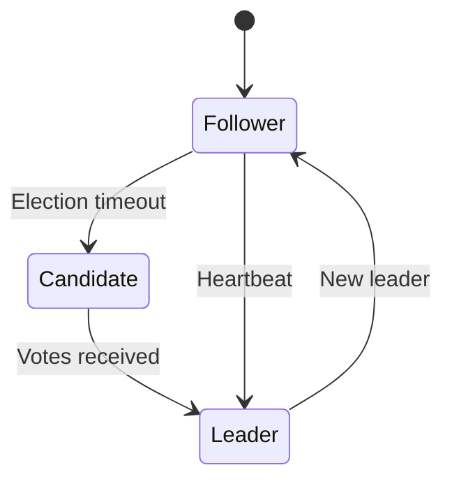

# Developer & DevOps Guide

Technical deep-dive into MaluWAF's design decisions, deployment patterns, and integration capabilities.

## Why MaluWAF?

### Design Philosophy

1. **Simplicity First** - Handle common web serving scenarios without extra infrastructure
2. **Defense in Depth** - Multiple WAF layers working together
3. **Operational Ease** - Single binary deployment, minimal dependencies
4. **Performance** - Async core with nginx-inspired concurrency

## Concurrency Model

### Tokio + Hyper Foundation

MaluWAF's reverse proxy uses Rust's async ecosystem for maximum performance:

```rust
// Simplified connection handling
async fn handle_connection(conn: TcpStream) {
    let mut conn = Http::new().serve_connection(conn, service);
    
    // HTTP/1.1 keep-alive handled automatically
    while let Some(request) = conn.next_request().await {
        let response = process_waf_pipeline(request).await;
        conn.send_response(response).await;
    }
}
```

**Benefits:**
- Single thread can handle thousands of concurrent connections
- No thread-per-connection overhead
- Efficient memory usage

### Worker Pool

```
┌─────────────────────────────────────────────────────────────┐
│                    MaluWAF Worker Pool                      │
└─────────────────────────────────────────────────────────────┘

                    ┌──────────────┐
                    │   Main Task  │
                    │ (Event Loop) │
                    └──────┬───────┘
                           │
           ┌───────────────┼───────────────┐
           │               │               │
           ▼               ▼               ▼
     ┌──────────┐   ┌──────────┐   ┌──────────┐
     │ Worker 1 │   │ Worker 2 │   │ Worker N │
     │──────────│   │──────────│   │──────────│
     │ Connection│   │ Connection│   │ Connection│
     │ Handler   │   │ Handler   │   │ Handler   │
     └──────────┘   └──────────┘   └──────────┘
           │               │               │
           └───────────────┼───────────────┘
                           │
                           ▼
                    ┌──────────────┐
                    │  Upstream    │
                    │  Connection  │
                    │    Pool      │
                    └──────────────┘
```

## WAF Pipeline Deep Dive

### Layer 1: Connection Handling

```rust
// SYN Flood Protection
struct SynFloodGuard {
    per_ip: HashMap<IpAddr, AtomicU32>,
    global: AtomicU32,
}

// Connection Rate Limiting
struct ConnectionRateLimiter {
    tokens: TokenBucket,
    max_connections_per_ip: u32,
}
```

### Layer 2: Protocol Validation

- HTTP method whitelist/blacklist
- Header length limits
- Content-Type validation
- Protocol anomaly detection

### Layer 3: Request Inspection

| Attack Type | Detection Method | Library |
|-------------|------------------|---------|
| SQL Injection | Pattern matching | libinjection |
| XSS | Pattern matching | libinjection |
| Path Traversal | Path normalization + patterns | Aho-Corasick |
| RFI | URL validation + patterns | Aho-Corasick |
| SSRF | Domain allowlist | Custom |

### Layer 4: Bot Mitigation

```toml
[bot_detection]
# Block AI training crawlers
block_ai_crawlers = true

# CSS honeypot (invisible link trap)
enable_css_honeypot = true

# JavaScript challenge for suspicious clients
enable_js_challenge = true
js_difficulty = 3  # 1-5

# Known bots allowlist
known_bots_allow = [
    "Googlebot",
    "Bingbot",
    "Slackbot",
]

# Block known AI scrapers
ai_crawlers_block = [
    "GPTBot",
    "ClaudeBot",
    "PerplexityBot",
]
```

### Layer 5: Response Filtering

- Sensitive data redaction
- Server header sanitization
- Error page templating

## Application Server Integration

### PHP-FPM

```toml
[site.fastcgi]
enabled = true
socket = "/var/run/php/php-fpm.sock"

[site.fastcgi.params]
SCRIPT_FILENAME = "$document_root$fastcgi_script_name"
```

Or TCP:

```toml
[site.fastcgi]
enabled = true
socket = "127.0.0.1:9000"
```

### Granian (Python WSGI/ASGI/RSGI)

Granian runs as a child process supervised by MaluWAF:

```toml
[site.granian]
enabled = true
interface = "asgi"  # or "wsgi", "rsgi"
bind = "127.0.0.1:5000"
workers = 4

[site.granian.app]
module = "myapp:app"
python_path = "/opt/myapp"
```

**Advantages:**
- No separate process supervisor needed
- Automatic restart on crash
- Minimal memory (shares worker memory space)
- Request/response through MaluWAF directly

### CGI (Legacy)

```toml
[site.cgi]
enabled = true
root = "/var/cgi"
 interpreters = {
     ".pl" = "/usr/bin/perl",
     ".sh" = "/bin/bash",
 }
```

## High Availability Design

### Overseer Election

Uses Raft consensus algorithm:



### Failover Process

1. Overseer detects master node failure
2. Traffic redirected to healthy masters
3. Workers reconnected to surviving masters
4. Failed master removed from mesh
5. Automatic rejoin when recovered

### Configuration Sync

```
┌─────────────────────────────────────────────────────────────┐
│                  Configuration Distribution                 │
└─────────────────────────────────────────────────────────────┘

   Admin changes config
          │
          ▼
   ┌──────────────┐
   │   Overseer  │
   │   (Leader)  │
   └──────┬───────┘
          │
          │ Atomic broadcast
          ▼
   ┌──────────────┐     ┌──────────────┐
   │   Master    │     │   Master     │
   │     A       │     │     B        │
   └──────────────┘     └──────────────┘
          │                    │
          ▼                    ▼
   ┌──────────────┐     ┌──────────────┐
   │   Workers    │     │   Workers    │
   │   apply      │     │   apply      │
   └──────────────┘     └──────────────┘
```

## Performance Tuning

### Kernel Parameters

```bash
# /etc/sysctl.conf
net.core.somaxconn = 65535
net.ipv4.tcp_max_syn_backlog = 65535
net.ipv4.ip_local_port_range = 1024 65535
net.ipv4.tcp_tw_reuse = 1
net.ipv4.tcp_fin_timeout = 15
```

### Worker Configuration

```toml
[server]
worker_processes = "auto"  # Match CPU cores
worker_connections = 10240
multi_accept = true
```

### Connection Pooling

```toml
[upstream]
keepalive = 100
keepalive_timeout = 60
```

## Monitoring

### Prometheus Metrics

```bash
# WAF metrics
maluwaf_waf_blocked_total
maluwaf_waf_allowed_total
maluwaf_attack_sqli_total
maluwaf_attack_xss_total

# Connection metrics  
maluwaf_connections_active
maluwaf_connections_accepted
maluwaf_connections_closed

# Upstream metrics
maluwaf_upstream_response_time
maluwaf_upstream_errors
```

### Health Checks

```toml
[health_check]
enabled = true
path = "/health"
interval = "10s"
unhealthy_threshold = 3
```

## Security Best Practices

### Production Checklist

- [ ] Generate secure admin token
- [ ] Enable TLS/HTTP3
- [ ] Configure rate limiting
- [ ] Set appropriate paranoia level
- [ ] Enable bot detection
- [ ] Configure log rotation
- [ ] Set up Prometheus monitoring
- [ ] Restrict admin API access
- [ ] Use firewall rules
- [ ] Regular rule updates

### Paranoia Levels

| Level | Use Case | Detection |
|-------|----------|-----------|
| 1 | Development | Basic patterns only |
| 2 | General Production | Balanced (recommended) |
| 3 | High Security | Aggressive, may cause false positives |

## Troubleshooting

### Connection Issues

```bash
# Check connection states
ss -s

# Check SYN backlog
netstat -s | grep SYN

# Check file descriptors
lsof -p $(pgrep maluwaf) | wc -l
```

### Debug Mode

```bash
RUST_LOG=debug ./maluwaf
```

### Common Issues

| Problem | Solution |
|---------|----------|
| High memory usage | Reduce `max_ips` in rate limiting config |
| Slow responses | Check upstream health, increase workers |
| Connection drops | Increase `worker_connections` |
| Blocks legitimate traffic | Lower paranoia level, check custom rules |

## Integration Examples

### Docker

```yaml
version: '3.8'
services:
  maluwaf:
    image: maluwaf:latest
    ports:
      - "80:80"
      - "443:443"
      - "443:443/udp"  # HTTP/3
    volumes:
      - ./config:/etc/maluwaf
      - ./sites:/etc/maluwaf/sites
    environment:
      - RUST_LOG=info
```

### Kubernetes

```yaml
apiDeployment:
apiVersion: apps/v1
kind: Deployment
metadata:
  name: maluwaf
spec:
  replicas: 3
  template:
    spec:
      containers:
      - name: maluwaf
        image: maluwaf:latest
        ports:
        - containerPort: 80
        - containerPort: 443
        env:
        - name: RUST_LOG
          value: "info"
```
