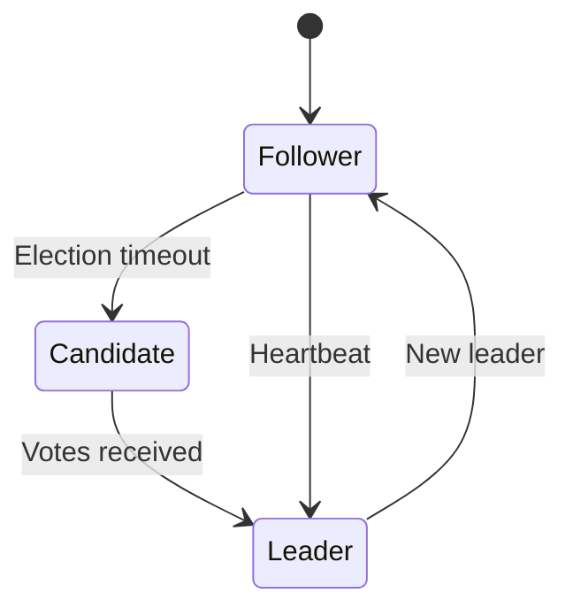

# Developer & DevOps Guide

Technical deep-dive into SynVoid's design decisions, deployment patterns, and integration capabilities.

## Why SynVoid?

### Design Philosophy

1. **Latency-Sensitive Unified Data Plane** - Keep I/O and cheap request-path work in one unified worker.
2. **Supervisor-Worker Isolation** - Centralize the control plane while keeping the data plane lightweight.
3. **gRPC Control Plane** - Robust, typed management API for automation and remote control.
4. **Core Affinity** - Maximize cache efficiency via deterministic CPU pinning.

## Concurrency Model

### Default Data Plane Contract

SynVoid defaults to one unified worker for network I/O plus bounded CPU offload workers for heavy tasks:

```rust
// Unified worker + offload workers
fn spawn_data_plane() {
    spawn_unified_server_worker(); // listener, TLS, routing, cheap WAF, streaming proxy
    spawn_cpu_workers();           // minify/compress/image/deep scan/plugin/serverless
}
```

**Benefits:**
- **Predictable latency:** Keep CPU-heavy work off the unified request path.
- **Bounded degradation:** Queue/deadline controls isolate offload saturation.
- **Clear scaling knobs:** Runtime/accept/offload capacity can be tuned independently.

### Worker Pool

```
┌─────────────────────────────────────────────────────────────┐
│              SynVoid Unified + CPU Offload Pool             │
└─────────────────────────────────────────────────────────────┘

                    ┌─────────────────┐
                    │    Supervisor   │
                    │ (Control Plane) │
                    └───────┬─────────┘
                            │ IPC (Config/Threats)
                            │
                            ▼
                 ┌─────────────────────┐
                 │ UnifiedServerWorker │
                 │ (latency-sensitive) │
                 └──────────┬──────────┘
                            │ IPC offload
                 ┌──────────┴──────────┐
                 ▼                     ▼
            ┌───────────┐         ┌───────────┐
            │CPU Worker │         │CPU Worker │
            │    1      │         │    N      │
            └───────────┘         └───────────┘
```

## Control Plane Architecture

### gRPC API

SynVoid's management interface is a formal gRPC service defined in `proto/control.proto`. This provides:
- **Type Safety:** Typed request/response structures.
- **Performance:** Efficient binary serialization via Protobuf.
- **Extensibility:** Easy integration with external monitoring and orchestration tools.

### Configuration Unification

Configuration management has been moved to the `synvoid-config` crate, providing a single source of truth for both Supervisor and Workers.

## High Availability Design

### Supervisor Election

Uses Raft consensus algorithm among Supervisor nodes:



### Failover Process

1. Supervisor cluster detects leader failure.
2. New leader elected via Raft.
3. Mesh routes updated to reflect the new control plane hub.
4. Workers continue handling traffic uninterrupted thanks to their isolated nature.

### Configuration Sync

```
┌─────────────────────────────────────────────────────────────┐
│                  Configuration Distribution                 │
└─────────────────────────────────────────────────────────────┘

   Admin changes config (gRPC)
          │
          ▼
   ┌──────────────┐
   │  Supervisor  │
   │   (Leader)   │
   └──────┬───────┘
          │
          │ 1. Raft Broadcast to Peers
          │ 2. Local IPC to Workers
          ▼
   ┌──────────────┐     ┌──────────────┐
   │    Worker    │     │    Worker    │
   │      A       │     │      B       │
   └──────────────┘     └──────────────┘
```

## Performance Tuning

### Kernel Parameters

```bash
# /etc/sysctl.conf
net.core.somaxconn = 65535
net.ipv4.tcp_max_syn_backlog = 65535
net.ipv4.ip_local_port_range = 1024 65535
net.ipv4.tcp_tw_reuse = 1
net.ipv4.tcp_fin_timeout = 15
```

### Worker Configuration

```toml
[server]
worker_threads = 0
unified_server_workers = 1

[tcp]
worker_pool_size = 4
```

## Monitoring

### Prometheus Metrics

Metrics are aggregated by the Supervisor from all workers:

```bash
# WAF metrics
synvoid_waf_blocked_total
synvoid_attack_sqli_total

# Data-plane metrics
synvoid_worker_connections_active
synvoid_http_request_latency_ms
synvoid.static.cpu_offload.queue_depth
synvoid.static.cpu_offload.active_tasks
synvoid.static.cpu_offload.task_timeouts

# Worker heartbeat payloads include `event_loop_lag_ms`, `request_queue_time_ms`,
# `active_connections`, `offload_submissions_total`, `offload_timeouts_total`,
# `offload_rejections_total`, `offload_fallbacks_total`, `inline_cpu_phase_times_ms`, and
# `body_buffering_bytes_total`
# for unified-worker latency analysis.
# CPU offload heartbeats include `worker_rss_bytes` alongside queue depth, active tasks,
# task submissions, inline-small fallbacks, timeout/rejection counts, and
# `cpu_offload_task_duration_ms` summaries by task kind.
```

## Security Best Practices

### Production Checklist

- [ ] Enable TLS for gRPC control plane.
- [ ] Configure mTLS for Supervisor-to-Supervisor communication.
- [ ] Keep `unified_server_workers` at 1 unless explicitly running advanced isolation mode.
- [ ] Enable Landlock sandboxing on Linux for workers.

## Troubleshooting

### Debug Mode

```bash
RUST_LOG=debug ./synvoid
```

### Common Issues

| Problem | Solution |
|---------|----------|
| High p99 latency | Verify CPU-heavy tasks are offloaded and offload queues are bounded. |
| gRPC connection refused | Verify TLS certificates and control plane port. |
| High jitter | Tune `worker_threads`/`tcp.worker_pool_size`, and verify heavy tasks are offloaded. |
