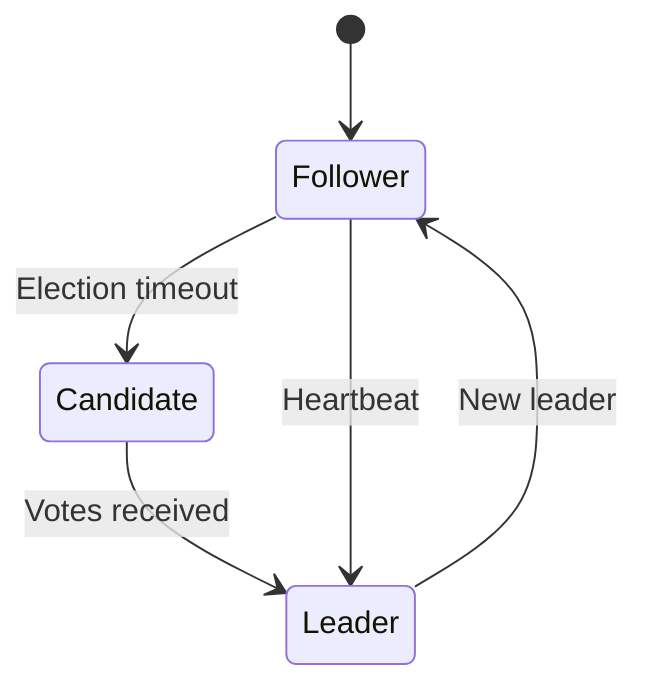

# Developer & DevOps Guide

Technical deep-dive into SynVoid's design decisions, deployment patterns, and integration capabilities.

## Why SynVoid?

### Design Philosophy

1. **Shared-Nothing Performance** - Eliminate coordination bottlenecks in the data plane.
2. **Supervisor-Worker Isolation** - Centralize the control plane while keeping the data plane lightweight.
3. **gRPC Control Plane** - Robust, typed management API for automation and remote control.
4. **Core Affinity** - Maximize cache efficiency via deterministic CPU pinning.

## Concurrency Model

### Shared-Nothing Data Plane

SynVoid utilizes a shared-nothing concurrency model where each worker process operates independently:

```rust
// Shared-nothing worker initialization
fn spawn_worker(core_id: usize) {
    // Pin to CPU core
    sched_setaffinity(0, core_id);
    
    // Bind with SO_REUSEPORT
    let listener = TcpListener::bind_with_reuse_port(addr);
    
    // Independent event loop
    tokio::runtime::Builder::new_current_thread()
        .enable_all()
        .build()
        .unwrap()
        .block_on(async move {
            loop {
                let (stream, _) = listener.accept().await?;
                tokio::spawn(handle_connection(stream));
            }
        });
}
```

**Benefits:**
- **Zero Lock Contention:** Workers don't share mutexes or state for request handling.
- **Linear Scalability:** Throughput scales predictably with the number of CPU cores.
- **Kernel Load Balancing:** `SO_REUSEPORT` allows the OS kernel to distribute traffic with minimal overhead.

### Worker Pool

```
┌─────────────────────────────────────────────────────────────┐
│                    SynVoid Shared-Nothing Pool              │
└─────────────────────────────────────────────────────────────┘

                    ┌─────────────────┐
                    │    Supervisor   │
                    │ (Control Plane) │
                    └───────┬─────────┘
                            │ IPC (Config/Threats)
           ┌────────────────┼───────────────┐
           │                │               │
           ▼                ▼               ▼
     ┌───────────┐    ┌───────────┐    ┌───────────┐
     │ Worker 1  │    │ Worker 2  │    │ Worker N  │
     │ (Core 0)  │    │ (Core 1)  │    │ (Core N)  │
     │───────────│    │───────────│    │───────────│
     │SO_REUSE-  │    │SO_REUSE-  │    │SO_REUSE-  │
     │PORT       │    │PORT       │    │PORT       │
     └───────────┘    └───────────┘    └───────────┘
```

## Control Plane Architecture

### gRPC API

SynVoid's management interface is a formal gRPC service defined in `proto/control.proto`. This provides:
- **Type Safety:** Typed request/response structures.
- **Performance:** Efficient binary serialization via Protobuf.
- **Extensibility:** Easy integration with external monitoring and orchestration tools.

### Configuration Unification

Configuration management has been moved to the `synvoid-config` crate, providing a single source of truth for both Supervisor and Workers.

## High Availability Design

### Supervisor Election

Uses Raft consensus algorithm among Supervisor nodes:



### Failover Process

1. Supervisor cluster detects leader failure.
2. New leader elected via Raft.
3. Mesh routes updated to reflect the new control plane hub.
4. Workers continue handling traffic uninterrupted thanks to their isolated nature.

### Configuration Sync

```
┌─────────────────────────────────────────────────────────────┐
│                  Configuration Distribution                 │
└─────────────────────────────────────────────────────────────┘

   Admin changes config (gRPC)
          │
          ▼
   ┌──────────────┐
   │  Supervisor  │
   │   (Leader)   │
   └──────┬───────┘
          │
          │ 1. Raft Broadcast to Peers
          │ 2. Local IPC to Workers
          ▼
   ┌──────────────┐     ┌──────────────┐
   │    Worker    │     │    Worker    │
   │      A       │     │      B       │
   └──────────────┘     └──────────────┘
```

## Performance Tuning

### Kernel Parameters

```bash
# /etc/sysctl.conf
net.core.somaxconn = 65535
net.ipv4.tcp_max_syn_backlog = 65535
net.ipv4.ip_local_port_range = 1024 65535
net.ipv4.tcp_tw_reuse = 1
net.ipv4.tcp_fin_timeout = 15
```

### Worker Configuration

```toml
[server]
worker_processes = "auto"  # Pins workers to available cores
worker_connections = 10240
```

## Monitoring

### Prometheus Metrics

Metrics are aggregated by the Supervisor from all workers:

```bash
# WAF metrics
synvoid_waf_blocked_total
synvoid_attack_sqli_total

# Shared-Nothing Worker Metrics
synvoid_worker_cpu_usage{core="0"}
synvoid_worker_connections_active{core="0"}
```

## Security Best Practices

### Production Checklist

- [ ] Enable TLS for gRPC control plane.
- [ ] Configure mTLS for Supervisor-to-Supervisor communication.
- [ ] Use `SO_REUSEPORT` for kernel-level load balancing.
- [ ] Enable Landlock sandboxing on Linux for workers.

## Troubleshooting

### Debug Mode

```bash
RUST_LOG=debug ./synvoid
```

### Common Issues

| Problem | Solution |
|---------|----------|
| Unbalanced worker load | Check `SO_REUSEPORT` kernel support and scheduler policy. |
| gRPC connection refused | Verify TLS certificates and control plane port. |
| High jitter | Ensure `worker_processes` matches physical cores and pinning is active. |
