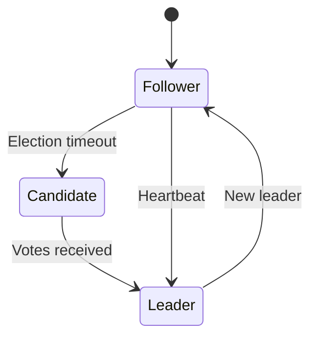

# Developer & DevOps Guide

Technical deep-dive into SynVoid's design decisions, deployment patterns, and integration capabilities.

## Why SynVoid?

### Design Philosophy

1. **Latency-Sensitive Unified Data Plane** - Keep I/O and cheap request-path work in one unified worker.
2. **Supervisor-Worker Isolation** - Centralize the control plane while keeping the data plane lightweight.
3. **gRPC Control Plane** - Robust, typed management API for automation and remote control.
4. **Core Affinity** - Maximize cache efficiency via deterministic CPU pinning.

## Concurrency Model

### Default Data Plane Contract

SynVoid defaults to one unified worker for network I/O plus bounded CPU offload workers for heavy tasks:

```rust
// Unified worker + offload workers
fn spawn_data_plane() {
    spawn_unified_server_worker(); // listener, TLS, routing, cheap WAF, streaming proxy
    spawn_cpu_workers();           // minify/compress/image/deep scan/plugin/serverless
}
```

**Benefits:**
- **Predictable latency:** Keep CPU-heavy work off the unified request path.
- **Bounded degradation:** Queue/deadline controls isolate offload saturation.
- **Clear scaling knobs:** Runtime/accept/offload capacity can be tuned independently.

### Worker Pool

```
┌─────────────────────────────────────────────────────────────┐
│              SynVoid Unified + CPU Offload Pool             │
└─────────────────────────────────────────────────────────────┘

                    ┌─────────────────┐
                    │    Supervisor   │
                    │ (Control Plane) │
                    └───────┬─────────┘
                            │ IPC (Config/Threats)
                            │
                            ▼
                 ┌─────────────────────┐
                 │ UnifiedServerWorker │
                 │ (latency-sensitive) │
                 └──────────┬──────────┘
                            │ IPC offload
                 ┌──────────┴──────────┐
                 ▼                     ▼
            ┌───────────┐         ┌───────────┐
            │CPU Worker │         │CPU Worker │
            │    1      │         │    N      │
            └───────────┘         └───────────┘
```

## Control Plane Architecture

### gRPC API

SynVoid's management interface is a formal gRPC service defined in `proto/control.proto`. This provides:
- **Type Safety:** Typed request/response structures.
- **Performance:** Efficient binary serialization via Protobuf.
- **Extensibility:** Easy integration with external monitoring and orchestration tools.

### Configuration Unification

Configuration management has been moved to the `synvoid-config` crate, providing a single source of truth for both Supervisor and Workers.

## High Availability Design

### Leader Election

Mesh nodes elect a leader with Raft (`crates/synvoid-mesh/src/mesh/raft/`;
`RaftInstance`, `consensus`, `edge_replica`, `state_machine`). The election runs
**between mesh nodes** — it is not a quorum of local Supervisor processes, which
are independent per host.


```mermaid
stateDiagram-v2
    [*] --> Follower
    Follower --> Candidate : Election timeout
    Candidate --> Leader : Votes received
    Leader --> Follower : New leader
    Follower --> Leader : Heartbeat
```

### Failover Process

1. Mesh cluster detects leader failure.
2. New leader elected via Raft.
3. Mesh routing/global-node records are updated to reflect the new control plane hub.
4. Local workers keep serving traffic; they are isolated from mesh leadership.

### Configuration Sync

```
┌─────────────────────────────────────────────────────────────┐
│                  Configuration Distribution                 │
└─────────────────────────────────────────────────────────────┘

   Admin changes config (gRPC)
          │
          ▼
   ┌──────────────┐
   │  Supervisor  │
   │   (Leader)   │
   └──────┬───────┘
          │
          │ 1. Raft Broadcast to Peers
          │ 2. Local IPC to Workers
          ▼
   ┌──────────────┐     ┌──────────────┐
   │    Worker    │     │    Worker    │
   │      A       │     │      B       │
   └──────────────┘     └──────────────┘
```

## Performance Tuning

### Kernel Parameters

```bash
# /etc/sysctl.conf
net.core.somaxconn = 65535
net.ipv4.tcp_max_syn_backlog = 65535
net.ipv4.ip_local_port_range = 1024 65535
net.ipv4.tcp_tw_reuse = 1
net.ipv4.tcp_fin_timeout = 15
```

### Worker Configuration

```toml
# [tokio] holds worker_threads (a bare number, or the string "auto"; a legacy
# { worker_threads = N } table is also accepted)
[tokio]
worker_threads = "auto"

# [process_manager] holds unified_server_workers. Note the Supervisor reads the
# live value from [defaults.worker_pool] workers, so that is the key to tune.
[process_manager]
unified_server_workers = 1

[defaults.worker_pool]
mode = "shared"
workers = 1     # <- the effective UnifiedServerWorker process count

# Top-level [tcp] listener pool
[tcp]
worker_pool_size = 4
```

## Monitoring

### Prometheus Metrics

Metrics are aggregated by the Supervisor from all workers and exported by the
supervisor-side telemetry bridge on `[metrics] bind_address:port`
(`127.0.0.1:9090` by default — `MetricsConfig::validate()` rejects any
non-loopback bind). The bridge additionally publishes worker heartbeat gauges
under the `synvoid.eggbench-telemetry.v2` contract.

```bash
# WAF / enforcement metrics (dotted names are sanitized to underscores,
# counters gain a _total suffix)
synvoid_request_enforcement_source_total{source="attack_detection"}
synvoid_request_enforcement_reason_total
synvoid.requests.blocked
synvoid.requests.proxied
synvoid.requests.upstream_error

# Data-plane metrics
synvoid.http.stalled
synvoid.http.blackhole_drop
synvoid.ratelimit.global_limited
synvoid.static.cpu_offload.queue_depth
synvoid.static.cpu_offload.active_tasks
synvoid.static.cpu_offload.task_timeouts

# Supervisor telemetry bridge (synvoid_subject_* gauges/counters)
synvoid_subject_event_loop_lag_ms
synvoid_subject_request_queue_p95_ms
synvoid_subject_active_connections
synvoid_subject_worker_memory_bytes
synvoid_subject_cpu_worker_rss_bytes

# Worker heartbeat payloads include `event_loop_lag_ms`, `request_queue_time_ms`,
# `active_connections`, `offload_submissions_total`, `offload_timeouts_total`,
# `offload_rejections_total`, `offload_fallbacks_total`, `inline_cpu_phase_times_ms`, and
# `body_buffering_bytes_total`
# for unified-worker latency analysis.
# CPU offload heartbeats include `worker_rss_bytes` alongside queue depth, active tasks,
# task submissions, inline-small fallbacks, timeout/rejection counts, and
# `cpu_offload_task_duration_ms` summaries by task kind.
```

## Security Best Practices

### Production Checklist

- [ ] Enable TLS for the gRPC control plane. The listener is `127.0.0.1:50051` by default (`[supervisor] control_api_addr`), not 9443. TLS is **server-authenticated only** — `src/supervisor/api.rs` sets `ServerTlsConfig::new().identity(...)` and never requests client certs, so there is no mTLS option today.
- [ ] Size the worker pool deliberately (`[defaults.worker_pool] workers`; shipped `config/main.toml` sets 4, code default is 1) — more workers add throughput, not isolation.
- [ ] Enable Landlock sandboxing on Linux for workers.

## Troubleshooting

### Debug Mode

```bash
RUST_LOG=debug cargo run --release
```

### Common Issues

| Problem | Solution |
|---------|----------|
| High p99 latency | Verify CPU-heavy tasks are offloaded and offload queues are bounded. |
| gRPC connection refused | Verify TLS certificates and control plane port. |
| High jitter | Tune `worker_threads`/`tcp.worker_pool_size`, and verify heavy tasks are offloaded. |
